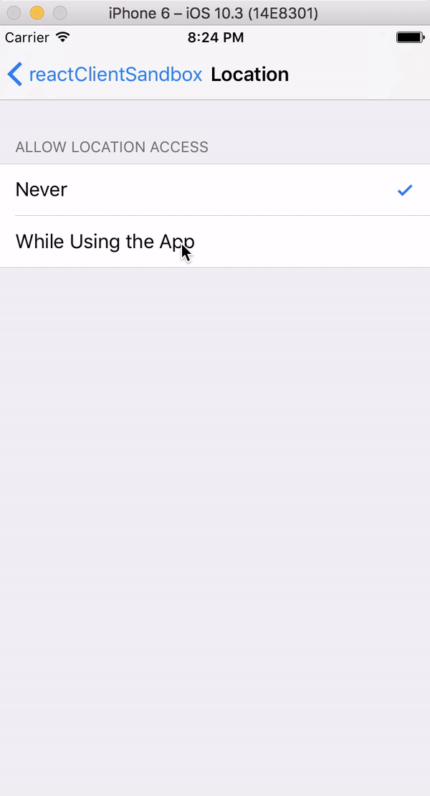

# React Native Location Switch

A react Native module to enable location based services on Android and IOS.

 

## Requirements
- react-native >= 0.38.0
- android buildToolsVersion 26.0.1
- gradle build tools 2.3.3


## Installation Android

1. npm install react-native-location-switch

2. add the following 2 lines to your <project>/android/settings.gradle file
   ```
   include ':react-native-location-switch'
   project(':react-native-location-switch').projectDir = new File(settingsDir, '../node_modules/react-native-location-switch/android')
   ```

3. add the following line to your <project>/android/app/build.gradle file
   ```
   compile project(':react-native-location-switch')
   ```

4. add the "LocationSwitchPackage" import into your MainApplication.java file:
   ```java
   import org.pweitz.reactnative.locationswitch.LocationSwitchPackage;
   ```
   
5. add the "LocationSwitchPackage" into your MainApplication.java file (getPackages method):
   ```java
    @Override
    protected List<ReactPackage> getPackages() {
      return Arrays.<ReactPackage>asList(
          new MainReactPackage(),
          ... // your other react native packages
          new LocationSwitchPackage()
      );
    }
    ```
   
6. add the following code into your MainActivity.java file:
    ```java   
    @Override
    public void onActivityResult(int requestCode, int resultCode, Intent data) {
        super.onActivityResult(requestCode, resultCode, data);
        LocationSwitch.getInstance().onActivityResult(requestCode, resultCode);
    }
    ```

## Installation IOS

1. Open the project in xCode, left click on the Libraries folder -> Add files to ... and select 
   ```
   ./node_modules/react-native-location-switch/ios/RNReactNativeLocationSwitch.xcodeproj
   ```

2. Open the project -> Build Phases -> Link Binary With Libraries and select libRNReactNativeLocationSwitch.a


## React Native Interface

```javascript
LocationSwitch.enableLocationService(
    interval,
    requestHighAccuracy,
    successCallback,
    errorCallback
);
```
```javascript
LocationSwitch.isLocationEnabled(
    successCallback,
    errorCallback
);
```

Option | Default | Info
------ | ------- | ----
interval | 1000 | Update interval in ms (ignored on IOS)
requestHighAccuracy | false | If true, highest accuracy is requested. If false, "block" level accuracy is requested (ignored on IOS)
successCallback | null | Is called when the user allows access to the location services or when the location services are already enabled
errorCallback | null | Is called when the user denies access to the location services

## Usage

```javascript
import React, { Component } from 'react';
import { AppRegistry, Text, View, TouchableOpacity, StyleSheet, Alert } from 'react-native';
import LocationSwitch from 'react-native-location-switch';

const style = StyleSheet.create({
  container: {
    flex: 1,
    alignItems: 'center',
    justifyContent: 'center',
  },
  button: {
    padding: 20,
  },
  text: {
    fontSize: 20,
  },
  textSuccess: {
    fontSize: 20,
    color: 'green',
  },
});

export default class LocationSwitchApp extends Component {

  constructor(props) {
    super(props);

    this.state = { locationEnabled: false };
    this.onEnableLocationPress = this.onEnableLocationPress.bind(this);
  }

  componentDidMount() {
    LocationSwitch.isLocationEnabled(
      () => {
        Alert.alert('Location is enabled');
        this.setState({ locationEnabled: true });
      },
      () => { Alert.alert('Location is disabled'); },
    );
  }

  onEnableLocationPress() {
    LocationSwitch.enableLocationService(1000, true,
      () => { this.setState({ locationEnabled: true }); },
      () => { this.setState({ locationEnabled: false }); },
    );
  }

  renderLocationStatus() {
    if (this.state.locationEnabled) {
      return <Text style={style.textSuccess} >Location enabled</Text>;
    }
    return <Text style={style.text}>Location disabled</Text>;
  }

  render() {
    return (
      <View style={style.container}>
        <TouchableOpacity style={style.button} onPress={this.onEnableLocationPress}>
          <Text style={style.text}>Enable location service</Text>
        </TouchableOpacity>
        {this.renderLocationStatus()}
      </View>
    );
  }
}

AppRegistry.registerComponent('reactClientSandbox', () => LocationSwitchApp);
```
